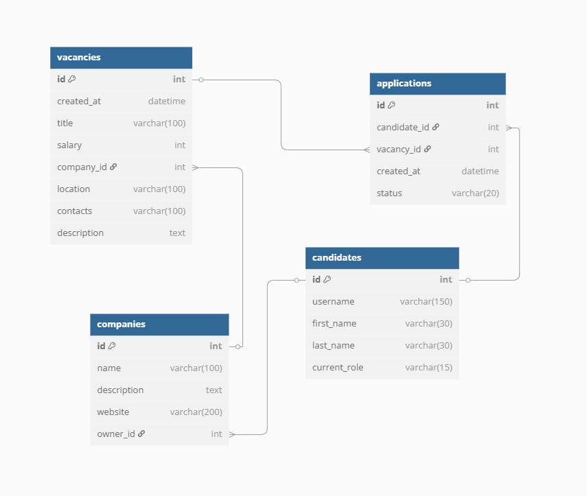

# ProForge

ProForge is a job search web application that allows users to browse and apply for job openings. The platform enables employers to post and manage job vacancies, while candidates can find suitable positions, save them, and apply directly through the site.

This project uses **Django** for the backend. **django-ckeditor** is utilized for handling rich text fields, and **django-js-asset** integrates JavaScript assets.

## About the Project

ProForge provides the following functionality for users:

- **Job Search**: Candidates can search for job vacancies by various criteria, including location, salary, and company.
- **Saved Vacancies**: Users can save their favorite vacancies for future reference.
- **Application Process**: Candidates can apply for jobs and track the status of their applications.
- **Employer Dashboard**: Employers can post new job openings, manage existing listings, and view applications.

## Features

- **Job Search**: Find jobs with various filters such as location, salary, and company.
- **Saved Jobs**: Candidates can save jobs they are interested in for later applications.
- **Job Applications**: Track application statuses (e.g., "Applied", "Interviewed", "Hired", "Rejected").

## Installation Guide

Start by cloning the repository to your local machine:

    python -m venv venv

    venv\Scripts\activate (on Windows)

    source venv/bin/activate (on macOS)

    pip install -r requirements.txt

    python manage.py loaddata fixture.json
